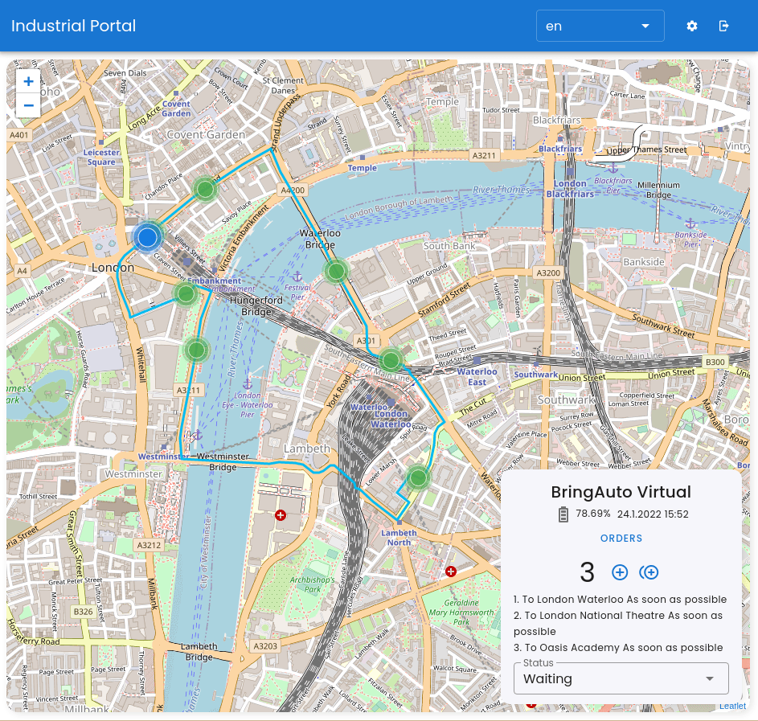

# Industrial Portal

BringAuto Industrial Portal is a system that connects autonomous platforms with the end-user!

Users can add orders, monitor the state of the platform, receive notifications about order fulfil, ... - has a complete overview about the platform.

Main features

- Simple end-user interface for autonomous platform control,
- Datastream for autonomous platform provider for further data processing (platform statistics)

## Functionality

End-user

- add order to the autonomous platform
- receive notification about order complete
- check stats of the platform like remaining battery, completed orders,
- check approximately

Platform provider

- consistent data stream
- workflows for industrial portal deployment (how to create a map)
- simple and general high customizable communication protocol between Autonomy system and the Industrial Platform
- virtual environment for testing and development - [Etna]

## Deploy Test Environment

You can deploy test instance of Industrial Portal
to Docker by our Virtual Environment [Etna] by [Run Test Environment].

## How to connect your Autonomous Platform

Third party Autonomous platform must comply [BringAuto Autonomy Host Protocol]
to connect to the Industrial Portal.

For the development and test purposes the [Etna] system can be used to
simulate/test/develop each part of BringAuto Industrial Portal.

## Create a feature/bug report

If you found a bug or have an idea for a nice improvement please
create an issue in the [GitHub Issue tracker].

If you need help please consider to use [GitHub Discussion]

[Etna]: https://github.com/bringauto/etna
[Run Test Environment]: ./doc/RunTestEnvironment.md
[GitHub Issue tracker]: https://github.com/bringauto/industrial-portal/issues
[GitHub Discussion]: https://github.com/bringauto/industrial-portal/discussions
[BringAuto Autonomy Host Protocol]: https://drive.google.com/drive/folders/1ZE9VRs86QtP6GqTJBl6vRJLmkh1lTEc5

