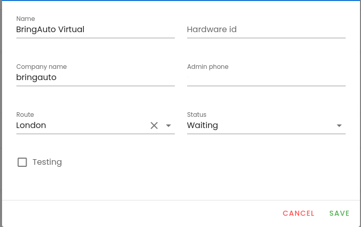

# Car

Car has following attributes

- `name: string`. Name of the car which will be shown in the GUI
- `companyName: string`. Name of the company to which the Car belongs to
- `underTest: bool`. If set to true we say that the car is in the test mode. If false the car is in normal mode.
- `routeId: int!`. Id of the Route entity. Each car can have assigned a Route
- `carAdminPhone: string`. Phone to which the notification about station departure will be delivered
- `callTwiml: string`. Twilio ML for station departure notification
- `fuel: float!`. Battery level in percents. Standard values lies in [0, 1]

Warning: not all attributes can be changed by GraphQL API.

## Car - normal mode

Normal mode in which tha car sends notification and users with User role can add orders.

## Car - test mode

If the car is marked as test (`underTest = true`) the following changes of normal mode behaviour are applied

- only user with role Admin can add orders,
- Twilio notifications are turned off

## Car Create/Update

- Go to the setting

- update car setting and click to save

