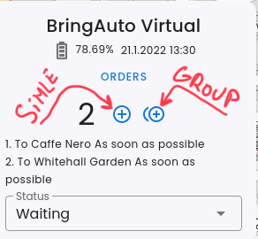
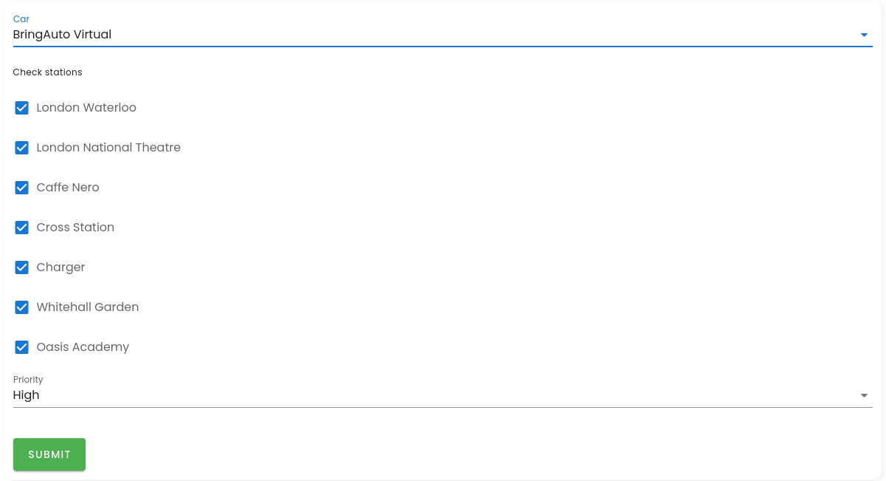

# Group Order

Group order enables us to create multiple orders that 
are sorted by the order of the [Stations] in an [Route] assigned to the
[Car].

- Click on Group order in the car status

- Choose which stations you want to add to the [Mission]

- click to apply to add selected orders to the [Mission]

## Update/Delete group order

It's same as for [SimpleOrder]

[Stations]: ./Station.md
[Car]: ./Car.md
[Route]: ./Route.md
[SimpleOrder]: ./SimpleOrder.md

