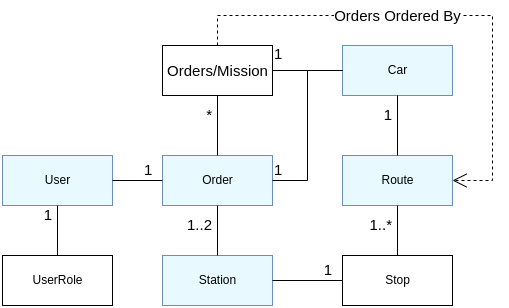

# BringAuto Fleet Entities and logic

Fleet is divided into two main parts

- Frontend (FE)
- Backend (BE)

Frontend is standard user interface written in vue.js.

Backend stores and process data from an autonomous platform and serves these
data to FE in simple form ([GraphQL] API)

Main entities served by BE to FE:

- [Car]
- [Route]
- [Station]
- [Order]
- [User]

Entities can be accessed by [GraphQL] API.

## Entities Relations

## Data Sources

Platform data are streamed to the BE and served by [GraphQL] API to
FE application.

Autonomous platform must comply with [BringAuto Autonomy Host Protocol] to connect to the Industrial Portal.

For development purposes you can use [BringAuto Etna] to
simulate real deployment of your platform or any part of Industrial Portal
(read data, react on events etc.) and test [BringAuto Autonomy Host Protocol]

[Car]: ./Car.md
[Route]: ./Route.md
[Station]: ./Station.md
[Order]: ./Order.md
[User]: ./User.md
[GraphQL]: ./GraphQL.md

[BringAuto Autonomy Host Protocol]: https://drive.google.com/drive/folders/1ZE9VRs86QtP6GqTJBl6vRJLmkh1lTEc5
[BringAuto Etna]: https://github.com/bringauto/etna
