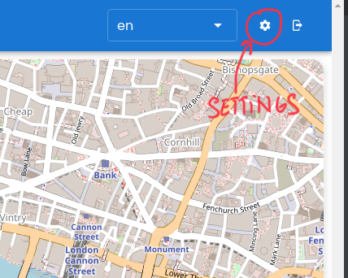
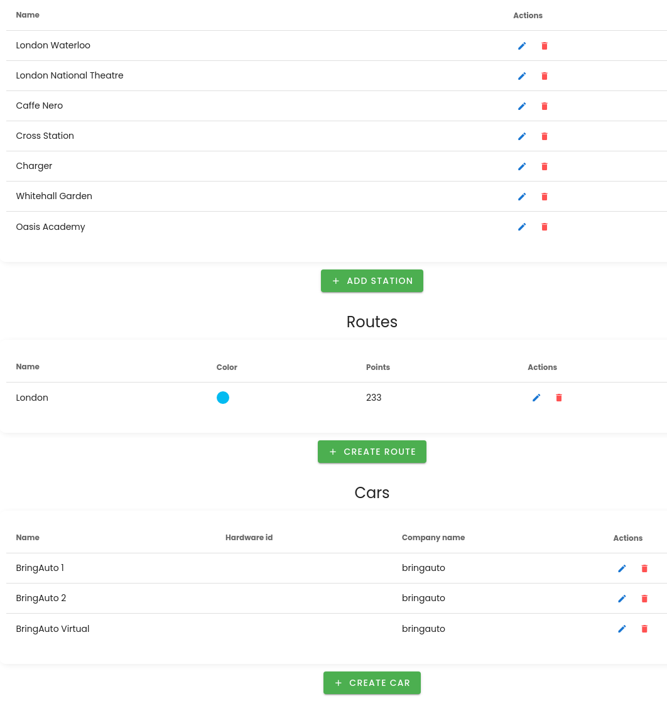
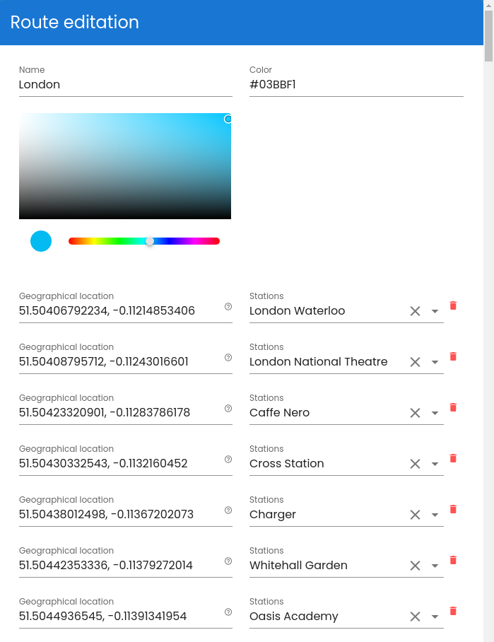

# Route

Route is linear list of [WGS84] coordinates which represents stops (it's not a [Station]!).

Each stop in the Route can have a [Station] assigned.

Station is a place where the car stops and waits for load/unload.

Properties

- `color: string`. String which represents color in format #FFFFFF
- `name: string`. Name of the route
- `stops: [RouteStop]`
- `RouteStop`:
  - `latitude: float`
  - `longitude: float`
  - `order: int`. The route is constructed by sort of stops by `order` from the smallest to the largest
  - `station: StationInfo`
  - `StationInfo`:
  	- `id: int`. Id of the [Station] entity. other fields like `name` and `conactPhone` are taken from [Station] entity repersented by id
	- `name: string`. Id
	- `contactPhone: string`. [Station] contact phone for Twilio notification

Warning: not all attributes can be changed by GraphQL API.

## Route Create/Edit

- Go to the settings

Update

- Click on route update, update route setting and click to Save

Create

- Click on Create Route, fill up route points and click to Save

[Station]: ./Station.md
[WGS84]: https://en.wikipedia.org/wiki/World_Geodetic_System
