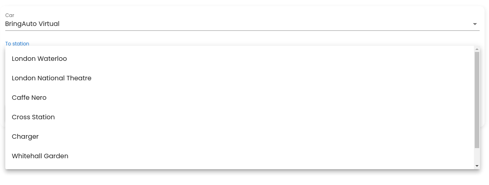
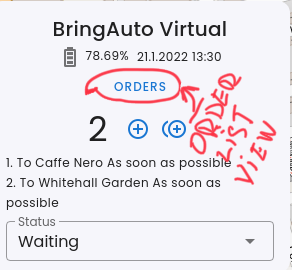
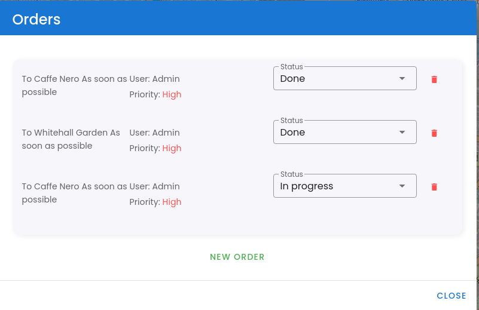

# Simple Order

Simple order just add exactly one order to the [Mission].

## Add simple order

- Click on the Simple order in the car status

- choose car and station where the autonomous platform shall g

- click to apply to add order to the [Mission]

## Update/Delete simple order

- Click on the ORDERS in the car status view

- Update or delete selected order

